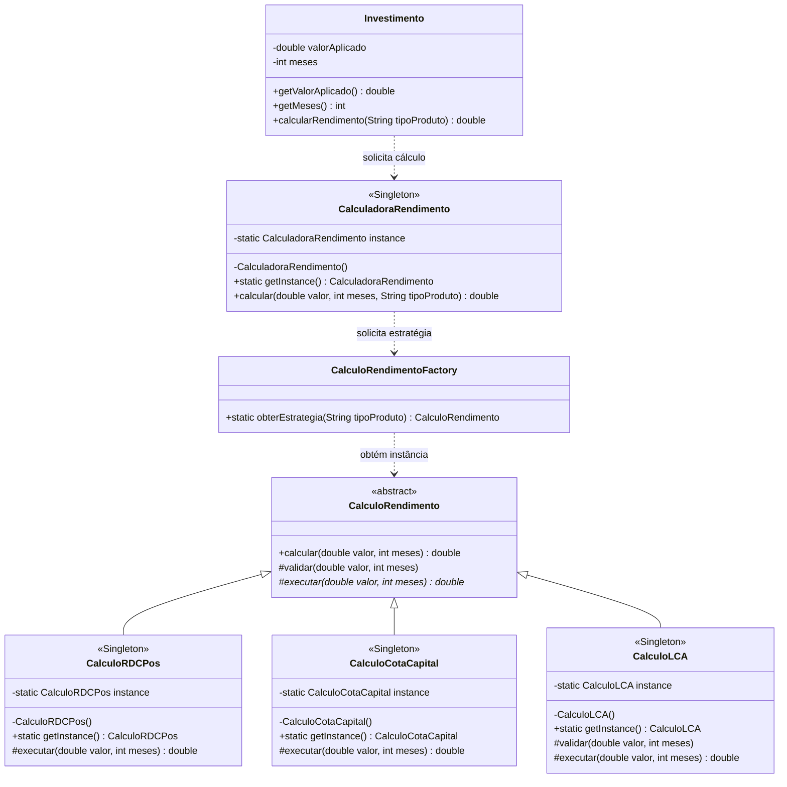

diagrama de classes:

```mermaid
classDiagram
    class Investimento {
        -double valorAplicado
        -int meses
        +getValorAplicado() double
        +getMeses() int
        +calcularRendimento(String tipoProduto) double
    }

    class CalculadoraRendimento {
        <<Singleton>>
        -static CalculadoraRendimento instance
        -CalculadoraRendimento()
        +static getInstance() CalculadoraRendimento
        +calcular(double valor, int meses, String tipoProduto) double
    }

    class CalculoRendimentoFactory {
        +static obterEstrategia(String tipoProduto) CalculoRendimento
    }

    class CalculoRendimento {
        <<abstract>>
        +calcular(double valor, int meses) double
        #validar(double valor, int meses)
        #executar(double valor, int meses)* double
    }

    class CalculoRDCPos {
        <<Singleton>>
        -static CalculoRDCPos instance
        -CalculoRDCPos()
        +static getInstance() CalculoRDCPos
        #executar(double valor, int meses) double
    }

    class CalculoCotaCapital {
        <<Singleton>>
        -static CalculoCotaCapital instance
        -CalculoCotaCapital()
        +static getInstance() CalculoCotaCapital
        #executar(double valor, int meses) double
    }

    class CalculoLCA {
        <<Singleton>>
        -static CalculoLCA instance
        -CalculoLCA()
        +static getInstance() CalculoLCA
        #validar(double valor, int meses)
        #executar(double valor, int meses) double
    }

    Investimento ..> CalculadoraRendimento : solicita cálculo
    CalculadoraRendimento ..> CalculoRendimentoFactory : solicita estratégia
    CalculoRendimentoFactory ..> CalculoRendimento : obtém instância
    CalculoRendimento <|-- CalculoRDCPos
    CalculoRendimento <|-- CalculoCotaCapital
    CalculoRendimento <|-- CalculoLCA

```
