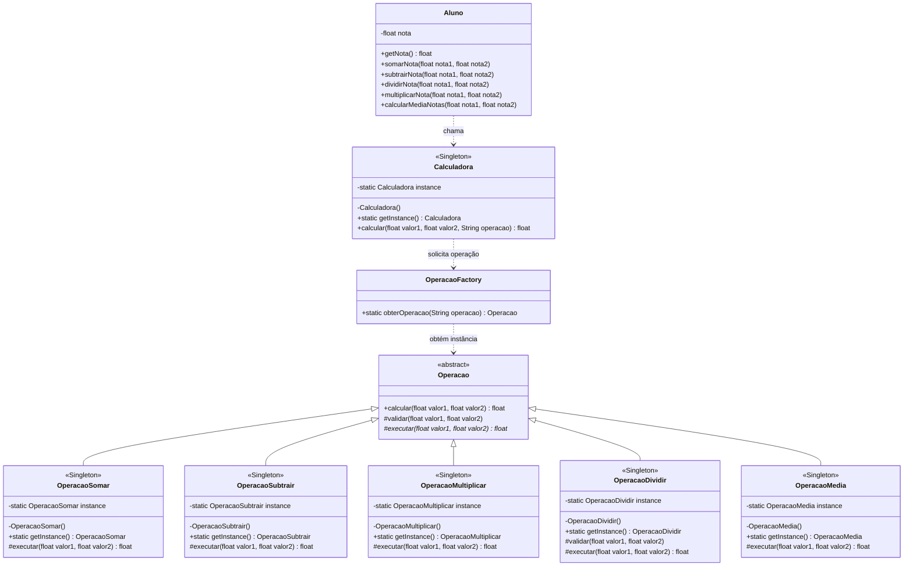

diagrama de classes:

```mermaid
classDiagram
    class Aluno {
        -float nota
        +getNota() float
        +somarNota(float nota1, float nota2)
        +subtrairNota(float nota1, float nota2)
        +dividirNota(float nota1, float nota2)
        +multiplicarNota(float nota1, float nota2)
        +calcularMediaNotas(float nota1, float nota2)
    }

    class Calculadora {
        <<Singleton>>
        -static Calculadora instance
        -Calculadora()
        +static getInstance() Calculadora
        +calcular(float valor1, float valor2, String operacao) float
    }

    class OperacaoFactory {
        +static obterOperacao(String operacao) Operacao
    }

    class Operacao {
        <<abstract>>
        +calcular(float valor1, float valor2) float
        #validar(float valor1, float valor2)
        #executar(float valor1, float valor2)* float
    }

    class OperacaoSomar {
        <<Singleton>>
        -static OperacaoSomar instance
        -OperacaoSomar()
        +static getInstance() OperacaoSomar
        #executar(float valor1, float valor2) float
    }

    class OperacaoSubtrair {
        <<Singleton>>
        -static OperacaoSubtrair instance
        -OperacaoSubtrair()
        +static getInstance() OperacaoSubtrair
        #executar(float valor1, float valor2) float
    }

    class OperacaoMultiplicar {
        <<Singleton>>
        -static OperacaoMultiplicar instance
        -OperacaoMultiplicar()
        +static getInstance() OperacaoMultiplicar
        #executar(float valor1, float valor2) float
    }

    class OperacaoDividir {
        <<Singleton>>
        -static OperacaoDividir instance
        -OperacaoDividir()
        +static getInstance() OperacaoDividir
        #validar(float valor1, float valor2)
        #executar(float valor1, float valor2) float
    }

    class OperacaoMedia {
        <<Singleton>>
        -static OperacaoMedia instance
        -OperacaoMedia()
        +static getInstance() OperacaoMedia
        #executar(float valor1, float valor2) float
    }

    Aluno ..> Calculadora : chama
    Calculadora ..> OperacaoFactory : solicita operação
    OperacaoFactory ..> Operacao : obtém instância
    Operacao <|-- OperacaoSomar
    Operacao <|-- OperacaoSubtrair
    Operacao <|-- OperacaoMultiplicar
    Operacao <|-- OperacaoDividir
    Operacao <|-- OperacaoMedia

```
